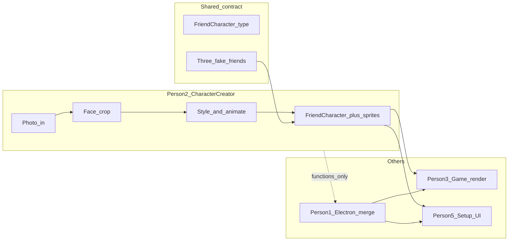

# Character creator vs Electron (Person 2 scope)

**Overview:** As Person 2 (Character creator), you do not need to own or build the Electron shell. Focus on producing `FriendCharacter[]` plus renderable animated sprites; Person 1 integrates your module into the desktop app at merge time.

**Short answer:** No — you should **not** work through Electron as your main track. Electron (transparent overlay, hotkey, window lifecycle, final merge) is **Person 1 (Steven)**. Your job is the **character pipeline and assets** that Person 3 renders and Person 5 surfaces in setup/roster UI.

The doc is explicit about parallel work: everyone builds against **three fake friends with placeholder images** first; **nobody waits for photo processing**. Electron integration is a **midpoint merge** goal (“one character moving and shootable inside Electron”), not day-one work for you.

---

## What you own vs what you skip

| You own (Person 2) | Person 1 owns | You collaborate on |
| --- | --- | --- |
| Photo ingest + face crop logic | Electron app shell, transparent overlay, hotkey | **Sprite/asset format** so Person 3 can draw hitboxes and animations |
| Character styles (look of the gremlin) | Wiring IPC, file dialogs → your APIs | **Mock `FriendCharacter[]`** in shared types |
| Animation states (idle, hit, respawn, wander if separate) | Merging everyone’s packages | Midpoint: “does my sprite look right in the overlay?” |
| Export: `FriendCharacter` + URLs/paths to sprite sheets or frame data | Installable build | Where upload UI lives (see below) |

---

## Recommended way to work (no Electron required)



1. **Implement a library or package** (e.g. `packages/character-creator/` once Person 1 scaffolds the repo) with pure functions or a small service:
   - Input: image file / buffer (+ optional name, vibe)
   - Output: one or more `FriendCharacter` entries **and** whatever Person 3 needs (e.g. `spriteSheetUrl`, frame size, animation map `{ idle, hit, respawn, walk }`)
2. **Develop and demo standalone** — fastest options for a hackathon:
   - Small **Vite/React** or **Canvas** page that loads mocks, runs crop/style, previews animation
   - Or **Node script** that writes assets to `dist/` and JSON for mocks  
   Electron is only needed to validate transparency/overlay behavior; that’s Person 1’s environment.
3. **Ship mocks on minute 30** — export the agreed shape so Kelvin (Person 3) can render placeholders **today**:

```ts
type FriendCharacter = {
  id: string;
  name: string;
  imageUrl: string;
  vibe: "chaotic" | "dramatic" | "supportive";
  quotes: { idle: string[]; hit: string[]; respawn: string[] };
};
```

   Extend **only with team agreement** (e.g. `spriteUrl`, `animations`, `hitbox`) — Person 3 should sign off so you don’t paint yourself into a format they can’t use in click detection.

4. **Photo upload UI split** — doc assigns “photo upload” to you and “setup screen, roster” to Person 5. Practical split:
   - **You:** processing API + preview component (optional)
   - **Person 5:** screen layout and flow; calls your `createCharacterFromPhoto(file)`
   - **Person 1:** native file picker in Electron if needed, passing the file path/buffer to your code  
   You don’t need to learn Electron APIs unless Person 1 is blocked and asks you to hook one call — still not “owning Electron.”

---

## When you *do* touch Electron (minimal)

- **Midpoint merge (~first build block end):** join Person 1 for 30–60 minutes to confirm sprites scale correctly on a transparent window and file upload path works.
- **Final stretch:** no new features — fix integration bugs only if assets fail to load in the packaged app (paths, `file://` vs bundled assets, CORS on local images).

If the core game works with **placeholder characters** first (doc’s rule), your real-photo pipeline can land in the **second build block** without blocking Person 3.

---

## Suggested deliverable checklist (hackathon)

1. Shared **`FriendCharacter`** (+ sprite fields) documented in repo README or `packages/shared/types.ts` (Person 1 creates file; you PR your extensions).
2. **`mockCharacters.json`** — three fake friends with placeholder images Person 3 uses immediately.
3. **`createCharacterFromPhoto()`** (or equivalent) — face crop + styled output; can start with a simple center crop if ML face detect slips.
4. **Animated sprite** — at minimum idle + hit (+ respawn if different); wander can reuse idle frames early.
5. One-line **handoff doc** for Person 3: image dimensions, anchor point, animation FPS, which URL/path Electron should load.

---

## Todos

- [ ] Sync with Person 3 on FriendCharacter extensions (sprite sheet, frames, hitbox/anchor) before building animations
- [ ] Publish three mock FriendCharacter entries + placeholder sprites for parallel dev (first 30 min)
- [ ] Implement photo → crop → style → animated asset + FriendCharacter export as importable module (no Electron)
- [ ] Midpoint: verify one real or mock character loads and animates inside Person 1’s overlay; fix asset paths only

---

## Current repo note

`README.md` is still brainstorming-only. Person 1’s “first 30 minutes” task is repo + app shell + five work areas. Until that lands, you can prototype character logic in this repo or a folder and paste in when the monorepo exists — **still without Electron**.

---

## Scope rule from the doc (relevant to you)

> Get the local game working before sponsor integrations.

Same idea for you: **mocks + sprite format first**, fancy photo styles second. Zo/Moss integrations are Person 4/5; you don’t need them for a working character object.
