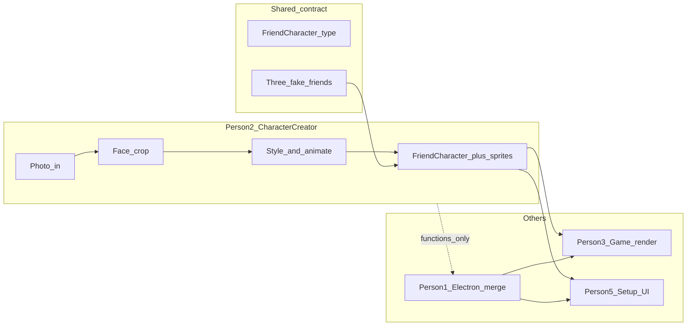

# Character creator vs Electron (Person 2 scope)

**Overview:** As Person 2 (Character creator), you do not need to own or build the Electron shell. Focus on producing `FriendCharacter[]` plus renderable animated sprites; Person 1 integrates your module into the desktop app at merge time.

**Short answer:** No — you should **not** work through Electron as your main track. Electron (transparent overlay, hotkey, window lifecycle, final merge) is **Person 1 (Steven)**. Your job is the **character pipeline and assets** that Person 3 renders and Person 5 surfaces in setup/roster UI.

The doc is explicit about parallel work: everyone builds against **three fake friends with placeholder images** first; **nobody waits for photo processing**. Electron integration is a **midpoint merge** goal (“one character moving and shootable inside Electron”), not day-one work for you.

---

## What you own vs what you skip

| You own (Person 2) | Person 1 owns | You collaborate on |
| --- | --- | --- |
| Photo ingest + face crop logic | Electron app shell, transparent overlay, hotkey | **Sprite/asset format** so Person 3 can draw hitboxes and animations |
| Character styles (look of the gremlin) | Wiring IPC, file dialogs → your APIs | **Mock `FriendCharacter[]`** in shared types |
| Animation states (idle, hit, respawn, wander if separate) | Merging everyone’s packages | Midpoint: “does my sprite look right in the overlay?” |
| Export: `FriendCharacter` + URLs/paths to sprite sheets or frame data | Installable build | Where upload UI lives (see below) |

---

## Recommended way to work (no Electron required)



1. **Implement a library or package** (e.g. `packages/character-creator/` once Person 1 scaffolds the repo) with pure functions or a small service:
   - Input: image file / buffer (+ optional name, vibe)
   - Output: one or more `FriendCharacter` entries **and** whatever Person 3 needs (e.g. `spriteSheetUrl`, frame size, animation map `{ idle, hit, respawn, walk }`)
2. **Develop and demo standalone** — fastest options for a hackathon:
   - Small **Vite/React** or **Canvas** page that loads mocks, runs crop/style, previews animation
   - Or **Node script** that writes assets to `dist/` and JSON for mocks  
   Electron is only needed to validate transparency/overlay behavior; that’s Person 1’s environment.
3. **Ship mocks on minute 30** — export the agreed shape so Kelvin (Person 3) can render placeholders **today**:

```ts
type FriendCharacter = {
  id: string;
  name: string;
  imageUrl: string;
  vibe: "chaotic" | "dramatic" | "supportive";
  quotes: { idle: string[]; hit: string[]; respawn: string[] };
};
```

   Extend **only with team agreement** (e.g. `spriteUrl`, `animations`, `hitbox`) — Person 3 should sign off so you don’t paint yourself into a format they can’t use in click detection.

4. **Photo upload UI split** — doc assigns “photo upload” to you and “setup screen, roster” to Person 5. Practical split:
   - **You:** processing API + preview component (optional)
   - **Person 5:** screen layout and flow; calls your `createCharacterFromPhoto(file)`
   - **Person 1:** native file picker in Electron if needed, passing the file path/buffer to your code  
   You don’t need to learn Electron APIs unless Person 1 is blocked and asks you to hook one call — still not “owning Electron.”

---

## When you *do* touch Electron (minimal)

- **Midpoint merge (~first build block end):** join Person 1 for 30–60 minutes to confirm sprites scale correctly on a transparent window and file upload path works.
- **Final stretch:** no new features — fix integration bugs only if assets fail to load in the packaged app (paths, `file://` vs bundled assets, CORS on local images).

If the core game works with **placeholder characters** first (doc’s rule), your real-photo pipeline can land in the **second build block** without blocking Person 3.

---

## Suggested deliverable checklist (hackathon)

1. Shared **`FriendCharacter`** (+ sprite fields) in [`packages/shared/src/types.ts`](../packages/shared/src/types.ts) — **done** (Person 1’s `src/shared/types.ts` still lacks `sprite`; unify at merge).
2. **`mockCharacters.json`** + PNG sheets under `packages/character-creator/assets/mocks/` — **done** (`npm run generate:mocks`).
3. **`createCharacterFromPhoto()`** — **done** (center crop, oval styled face, vibe tint; no ML face detect yet).
4. **Animated sprite** — **done** (14 frames: idle, walk, hit, respawn on 72×108 sheet).
5. **Handoff docs** — **done**: [`sprite-handoff-person3.md`](./sprite-handoff-person3.md), [`electron-integration-notes.md`](./electron-integration-notes.md).

---

## Todos

### Done (Person 2)

- [x] Publish three mock `FriendCharacter` entries + sprite sheets (`Alex`, `Jordan`, `Sam`).
- [x] Package `@tiny-menaces/character-creator` — `createCharacterFromPhoto`, `loadMockCharacters`, crop/style/sheet helpers (no Electron dep).
- [x] Preview app — `npm run preview` → http://localhost:5174 (same asset URLs as handoff doc).
- [x] Photo pipeline smoke-tested (e.g. Phil via `npm run create:character`).
- [x] Gremlin art pass — visible body/arms, oval face cutout (not square photo frame).
- [x] **Person 3 sign-off:** Hitbox, anchor, frame clips, and `sprite-handoff-person3.md` contract approved for game renderer.

### Next — you (Person 2)

- [x] **Roster workflow:** `face-crop:avatar --roster` upserts `characters.json`; dev mocks stay in `mockCharacters.json` (`generate:mocks` does not wipe real friends).
- [ ] **Push `character-creator` branch** so Person 1/3/5 can depend on packages (`158498a` initial sprites commit is local until pushed).
- [x] **Golden path:** Steven — two-photo + lasso → `assets/sources/steven/v2_/` → `built/steven` → roster (`verify:preview` passes). Documented in [`builder-part-crops.md`](./builder-part-crops.md).
- [ ] **Optional polish:** Better default quotes (incl. Steven); tighter face crop when you add face detection; keep `fio-face.png` out of git if photos should stay local.

### Next — with Person 1 (Electron midpoint)

- [ ] **Midpoint:** **Steven** animates in the transparent overlay (golden-path roster entry) — wire `loadRosterCharacters()` / path resolver in `src/electron/main.ts`, map `/built/steven/...` URLs, expose full roster over IPC, reuse `apps/character-preview/src/spriteRenderer.ts` in renderer.
- [ ] **Unify types:** Electron should import `FriendCharacter` from `@tiny-menaces/shared` (or mirror the `sprite` field); today `src/shared/types.ts` is portrait-only.
- [ ] **Photo upload path:** Main reads file → `createCharacterFromPhoto` → save under `userData` with `file://` URLs (see integration notes).

### Blocked on others (track, don’t build alone)

- [ ] **Person 5:** Setup/roster UI calls your API; you don’t need to own the screen layout.
- [ ] **Person 1:** File picker, packaging, `file://` / bundled asset paths.

---

## Current repo note

`main` has the Electron shell (`npm start`). Character work lives on branch **`character-creator`** with `packages/*`, `apps/character-preview`, and root scripts (`preview`, `create:character`, `generate:mocks`). Merge/rebase with `main` as Steven’s shell evolves; Electron does **not** load your package yet — that’s the midpoint merge above.

---

## Scope rule from the doc (relevant to you)

> Get the local game working before sponsor integrations.

Same idea for you: **mocks + sprite format first**, fancy photo styles second. Zo/Moss integrations are Person 4/5; you don’t need them for a working character object.
